# Apex_Tick

Bounded FPGA trading acceleration with reproducible correctness and explicit measurement boundaries.

This first implementation contains a public synthetic quote codec, an independent Python state-machine oracle, a normalized-event SystemVerilog trading core and an Icarus differential scoreboard. It provides executable foundations for a future measured board implementation. No FPGA board, exchange session or STAC benchmark is exercised by this release.

## Reproduce

Install Python 3.11+ and Icarus Verilog (`iverilog` and `vvp`). Verification fails when Icarus is absent rather than quietly skipping RTL tests.

```bash
python -m venv .venv
source .venv/bin/activate
pip install -e '.[test]'
python -m pytest -q
apex-tick demo
python verification/verify.py
```

The scoreboard compares 800 transitions per seed, including integrity failures, gaps, duplicate sequence numbers, stale configuration, rate/exposure limits, terminal events and output stalls. This is finite simulation coverage, not a proof of all interleavings or a production safety claim.

## Exact initial scope

[Open workload](spec/open-tick-v0.json) uses a 36-byte synthetic ask quote. Prices and quantities are unsigned integer units. The core supports 8 instruments, 16 pending order identities, a deterministic threshold trigger, outstanding-quantity risk and an order count limit per 64 clock cycles. These bounds are configuration and synthesis parameters; they are not throughput or latency forecasts.

The [RTL core](rtl/apex_tick_core.sv) accepts normalized fields and trusted frame-integrity evidence. The software codec validates its application CRC and requires a separately established Ethernet integrity flag. Hardware decode, Ethernet PHY/PCS/MAC, the output wire serializer and a production TCP/exchange session remain future adapters.

## Transaction and recovery rules

An output register slot, order identity, pending ledger entry and exposure reservation are committed together. A stalled output remains stable. Duplicate inputs do not create another order. Terminal events release only a sent identity once; transmission alone never releases exposure. Unknown terminal events cannot reduce exposure.

Integrity failures, gaps, invalid instruments, stale epochs and invalid quote fields hold new commits. Recovery requires a newer configuration epoch and zero known pending exposure. After hard reset, a trusted host must reconcile any lost outstanding obligations before reauthorizing the core. The RTL does not authenticate host reconciliation or exchange terminal messages; those are explicit integration requirements.

## Hardware and benchmark path

[Platform contracts](boards/platform-contracts.json) identify Cisco K3P-S, AMD U200/U250 and AMD UL3524 candidates, with eFPGA/hybrid/custom ASICs as qualified partner feasibility paths. These are contracts, not shipped board support. An exact board, transceiver/MAC configuration, clock constraints, IP license, physical implementation and external calibration are required before a latency result exists.

Corundum exposes a lowest-latency direct application interface synchronous to MAC clocks. That makes it a candidate integration point, not a guarantee about this core. [Corundum documentation](https://docs.corundum.io/en/latest/modules/mqnic_app_block.html).

Cisco's K3P-S datasheet identifies XCKU3P-2, two SFP28 ports and 4 ns timestamp resolution; resolution alone cannot validate sub-nanosecond improvements. [Cisco datasheet](https://www.cisco.com/c/en/us/products/collateral/interfaces-modules/nexus-smartnic/datasheet-c78-743827.html).

The historical Exegy/AMD STAC-T0 minimum of 13.9 ns starts at the last required inbound decision bit and ends at the first simulated order bit. It is not an Apex_Tick target prediction or a full-frame execution time. [June 2024 report](https://docs.stacresearch.com/news/AMD240422).

Strict integrity validation and early action before final FCS must use distinct profiles. The first core requires validation before action. No physical timing, placement-and-route, formal proof, line-rate Ethernet or live trading result is claimed.

## Ecosystem interfaces

[Apex_ULL](https://github.com/AAH20/Apex_ULL) provides native CPU baselines and prospective host tools. [Apex_PerfAtlas](https://github.com/AAH20/Apex_PerfAtlas) owns evidence contracts, comparison eligibility and deployment economics. Run `python verification/emit_evidence.py --output output/simulation` to retain a simulation manifest and trace. Validate it with `apex-atlas validate output/simulation/run.json` after installing Apex_PerfAtlas. The adapter emits functional cycle counts and no nanosecond metric.

Independent finance/optimization/GRC projects retain their own positioning; their scenario, offline experiment and custody adapters are candidates.

[Architecture source](docs/tick.mmd) shows the intended complete pipeline. Components beyond the normalized core are integration contracts and must pass the [release gates](docs/release-gates.md).

Copyright 2026 Ahmed Hassan. Apache-2.0 for original software and RTL. Third-party IP retains its own license; Apex_ULL remains AGPL-3.0-or-later. Integration inquiries: aah@a2zsoc.com.



Editable [Mermaid source](docs/tick.mmd). Node labels distinguish implemented components, trusted inputs, and planned adapters. The architecture includes future gates; it is not a claim that the full pipeline has shipped.
